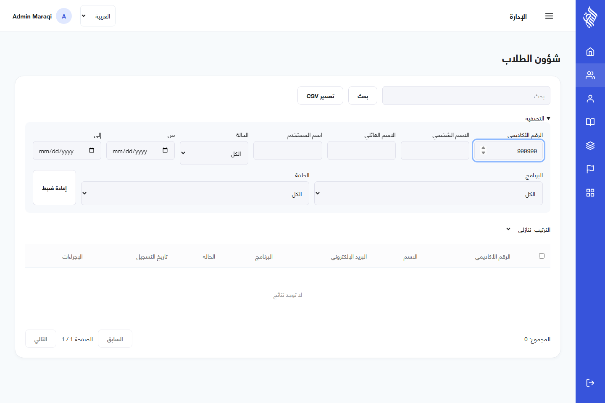

# Backoffice verification — 2026-09-17

Phase-6 follow-up: **9 focused tests and all 4 browser scenarios passed** after the session-refresh fix. Browser photo upload/persisted preview and mobile-API enrollment reflected in the backoffice are now verified. Network/server failures during refresh preserve the session; actual revoked credentials still sign out. The initial memorized-hizb label is now explicit in both languages. Production container rebuild/health passed. See workspace `docs/SYSTEM_ACCEPTANCE.md`; the earlier photo limitation below is superseded by this follow-up.

## Executed checks

| Check | Result |
| --- | --- |
| TypeScript, ESLint, Prettier | Pass |
| Focused Jest tests | 5 passed |
| Chromium browser suite against production Nginx | 4 passed |
| Production TypeScript/Vite build in Node 24 Alpine | Pass |
| One-service Docker Compose startup and health | Pass |
| Independent Git repository, ignored `.env` and test traces | Pass |
| Backend compatibility regressions | 24 integration tests and 6 focused tests passed |

The browser suite exercises anonymous deep-link protection, Arabic/English switching, form validation, server errors, empty lists, a 390px RTL layout and the real API workflow below. Tests use the actual Docker backoffice at `http://localhost:5173`; its Nginx proxy connects to the separate backend. The final real-API run also passed after the backend rate-limit fix.

## Real API workflow

- Administrator signs in using HttpOnly cookies through the production proxy.
- Create/edit bilingual riwayat; create a group with real program, teacher and riwaya relationships.
- Edit a weekly schedule without duplicating its saved planning entries.
- Edit a teacher's English name and secondary phone; verify persisted API values.
- Edit a student, set then clear a phone number, filter the student list and change status through bulk selection.
- Download CSV, confirm deletion, switch to Arabic, log out and verify protected routes redirect to login.
- Test fixtures are removed afterwards. Seven fixtures left by early interrupted runs were separately identified by exact test-only names and removed. No legacy or user records were migrated/deleted.

The backend integration suite additionally verifies Admin-uploaded teacher photo ownership, unauthorized ownership changes and private MinIO storage. Browser photo selection and signed-image preview have not received a separate end-to-end test.

## Corrections found during implementation

- Replaced broken legacy navigation and Firebase assumptions with working NestJS administrator sessions.
- Preserved schedule IDs during updates; rejected reversed/overlapping slots.
- Avoided duplicate teacher creation if its subsequent photo upload fails.
- Fixed student validation when nullable teacher-only fields were returned by the API.
- Clearing optional fields now sends explicit nulls; student birth-date/category requirements remain enforced.
- Monthly absence percentages use recorded sessions instead of dividing by 30 days. Recorded memorized hizb count is shown; the legacy calculation that counted every passed assessment as a full hizb is not reproduced. A cumulative verse-derived total still needs canonical academic data and cross-client acceptance in phase 6.
- Restored the supplied Arabic font, localized status labels and bilingual teacher names.
- Neutralized spreadsheet formula prefixes in CSV exports and reported partial bulk failures accurately.
- Separated authentication and ordinary API rate-limit counters; normal browsing no longer exhausts the login quota. A real Fastify regression test verifies both limits still apply.

## Reference and feature mapping

The six implemented legacy management areas are students, teachers, groups, programs, categories and riwayat. The home screen was a placeholder. Payment screens are deliberately excluded; old unrouted navigation items are not treated as functioning features.

See [README](../README.md) for the `front-ref` structure/library mapping and deployment configuration. Backend migrations add bilingual profile fields, secondary phone, national identity number and revision cadence required by legacy forms. They do not import old data.

## Evidence and external checks

Canonical academic content, SMTP delivery, remote GitHub Actions/SSH deployment and production HTTPS require the later configuration already agreed with the user. The deployment workflow was prepared and local container builds were executed; no remote deployment was claimed. Browser coverage is Chromium, not a claim of exhaustive browser or accessibility certification. Android and cross-client system acceptance are subsequent phases.

On this Windows host, direct `node_modules/.bin/*.cmd` invocations were used for checks because the installed host Yarn did not resolve command shims reliably. The Docker build executes the documented `yarn build` successfully.
